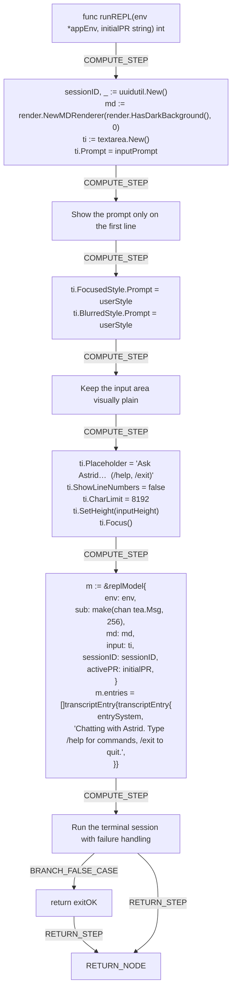

# Interactive Mode (REPL)

# Interactive REPL Mode

Use the CLI's interactive REPL to have a back-and-forth chat with Astrid in a single terminal session.

## Starting a session

Run the [runAsk](internal/cli/ask.go) without typing a question, and when your input is a live terminal, [resolveQuery](internal/cli/ask.go) switches automatically into interactive mode. From there, [runREPL](internal/cli/repl.go) creates a session id, detects your terminal's background for markdown styling, and opens a full-screen chat window seeded with a welcome message telling you to type /help for commands or /exit to quit.

## Chatting

Type your question and press enter to send it. Slash commands are handled by [runCommand](internal/cli/repl.go): /help shows the built-in help text, /new (or /reset) starts a fresh conversation, /workspace (or /ws) opens the workspace picker or switches directly when you give a name, and /pr opens the pull request picker, clears the active PR with `/pr clear`, or sets one directly. See the [command reference](reference.md) for the full list, and [managing workspaces](workspaces.md) for workspace switching details.

## Exiting

Type /exit or /quit at any time, and [runCommand](internal/cli/repl.go) ends the session right away.

See also [getting started](index.md), [logging in](login.md), and [asking questions](ask.md).

