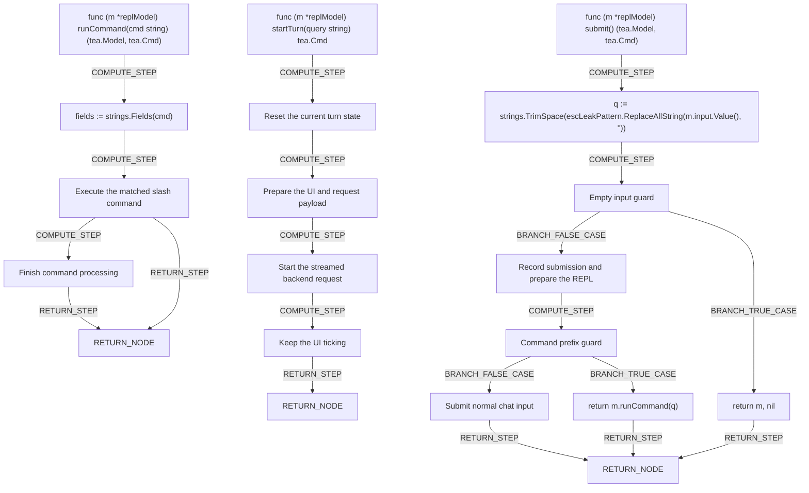

# Interactive Mode (REPL)

Astrid's interactive mode turns the command line into a live conversation. Instead of typing one command and waiting for a single reply, you open a persistent session where you can ask questions, get streamed answers, and switch context — all without leaving the terminal.

## Starting a session

When you launch interactive mode, Astrid sets the whole experience up before you type a single character: it opens a new conversation session, checks whether your terminal uses a light or dark theme so answers render legibly, prepares the input box, and prints a short welcome message with a hint on how to get commands — all inside [runREPL](internal/cli/repl.go). If you haven't used Astrid before, the [Getting Started](getting-started.md) guide walks through installation and first login before you reach this point.

Everything that happens after that point — your keystrokes, the streaming answer text, terminal resizes, background lookups — flows through one central state object, the [replModel](internal/cli/repl.go), and one central router, [Update](internal/cli/repl.go), which decides whether a message means "resize the screen," "handle a keypress," "append streamed text," or "apply a workspace switch."

## Typing and getting answers

You type into a normal-feeling input line at the bottom of the screen. Pressing Enter hands your text to [submit](internal/cli/repl.go), which trims stray whitespace, saves your line to history, clears the box, and scrolls the view down to the latest activity. From there your input takes one of two paths: if it starts with `/` it's treated as a command; otherwise it's logged as a new message and a fresh answer cycle begins.

That second path is where the "conversation" feeling comes from. [startTurn](internal/cli/repl.go) cancels any answer still in flight, shows a "thinking…" status, and sends your question off in the background while streaming the reply back piece by piece — so you watch the answer build up in real time rather than waiting for it all at once. Ctrl+C or Esc during that streaming stops the current answer early, and Enter is ignored mid-stream so you can't accidentally interrupt or edit while a response is arriving, all handled in [handleKey](internal/cli/repl.go). More detail on the kinds of questions you can ask this way is covered in [Asking Questions](asking-questions.md).

## Slash commands

Any line starting with `/` is routed by [runCommand](internal/cli/repl.go) instead of being sent as a question:

- `/exit` or `/quit` — closes the session.
- `/help` — prints the built-in help text into the transcript.
- `/new` or `/reset` — clears the current conversation and starts fresh, via [newConversation](internal/cli/repl.go).
- `/pr` — with no argument, opens a picker of your pull requests; with `clear`, drops the active PR scope; with a URL or ID, validates and applies that specific PR.
- `/workspace` or `/ws` — with a name, switches straight to that workspace; with no argument, opens a workspace picker.

Anything else typed with a leading `/` gets a friendly "unknown command" note rather than being silently ignored. The full list of commands, including ones available outside interactive mode, is catalogued in the [Command Reference](command-reference.md).

## Switching workspaces and pull requests mid-conversation

Typing `/workspace` with no name, or `/pr` with no argument, opens an on-screen picker rather than requiring you to remember exact names. Inside the workspace picker, arrow keys move the highlighted row, Enter confirms your choice and immediately switches context, and Escape backs out without changing anything — all handled in [handlePickerKey](internal/cli/repl.go). The pull request picker works the same way, with one extra safeguard: [handlePRPickerKey](internal/cli/repl.go) checks whether a highlighted PR review is actually ready before letting you select it, showing a readable status message if it isn't. Behind the scenes, resolving a typed workspace name checks it against both its short slug and its display name via [switchWorkspaceCmd](internal/cli/repl.go), and resolving a pasted PR URL validates it's a real, ready pull request in your current workspace via [setPRCmd](internal/cli/repl.go). For a deeper look at what workspaces and PR scoping mean day-to-day, see [Managing Workspaces](managing-workspaces.md).

## Everyday conveniences

The session feels forgiving in small but important ways, all coordinated through [handleKey](internal/cli/repl.go):

- **Up/Down arrows** step backward and forward through everything you've typed in the session — but only when no answer is currently streaming.
- **Page Up/Page Down** scroll through the transcript without touching your draft input.
- **Ctrl+D** on an empty, idle input line quits the session cleanly.
- Stray escape sequences that sometimes leak into pasted text are automatically stripped from what you type by [sanitizeInput](internal/cli/repl.go).

## Leaving the session

Typing `/exit`, `/quit`, or pressing Ctrl+D on an empty prompt ends the program the same way, returning a normal success code once the session closes via [runREPL](internal/cli/repl.go). If you haven't set up your account or default configuration yet, [Logging In](logging-in.md) and [Configuration](configuration.md) cover what needs to be in place before interactive mode has a workspace to talk to.

