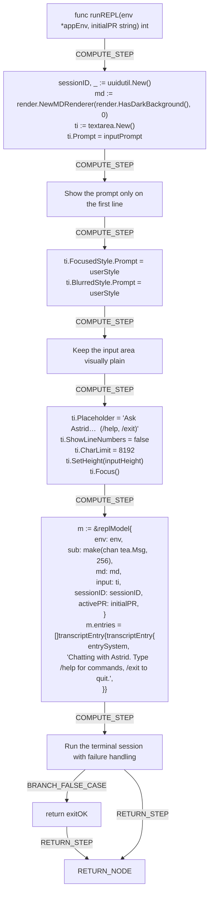

# Interactive Mode (REPL)

# Interactive REPL Mode

Astrid's interactive REPL lets you chat with Astrid, switch workspaces, and scope your questions to a pull request, all from one continuous terminal session.

## Starting a Session

Launching interactive mode hands control to the [runREPL](internal/cli/repl.go), which creates a new session identifier, prepares the markdown-aware terminal renderer, and configures the text input area before launching the full-screen Bubble Tea program. The session opens with a welcome message reminding you to type `/help` for commands or `/exit` to quit. If you're not sure how to get set up first, see the [Getting Started](index.md) guide, and make sure you're [logged in](login.md) beforehand.

## Chatting

Once the session is running, just type your question and press enter to ask Astrid — see [Asking Questions](ask.md) for tips on getting good answers. You can also type slash commands, which are interpreted by the [runCommand](internal/cli/repl.go): `/help` shows the built-in help text, `/new` (or `/reset`) starts a fresh conversation, `/workspace` (or `/ws`) opens a workspace picker or switches directly to a named workspace, and `/pr` opens a pull request picker, sets a specific PR, or clears the active PR scope with `/pr clear`. Full details on workspaces are in [Managing Workspaces](workspaces.md), and every command is listed in the [Command Reference](reference.md).

## Exiting

Type `/exit` or `/quit` at any time to end the session, which the [runCommand](internal/cli/repl.go) handles by quitting the Bubble Tea program cleanly.

