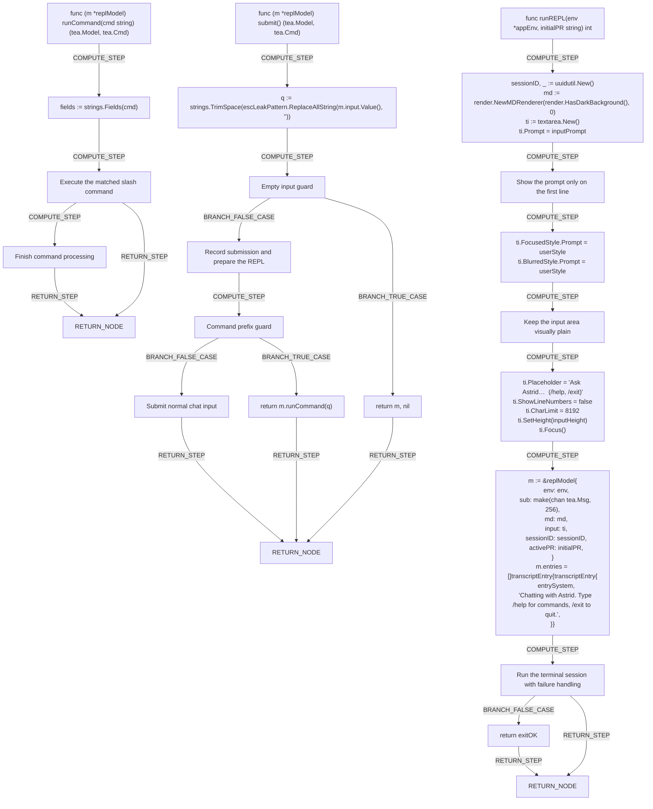

# Interactive Mode (REPL)

# Interactive REPL Mode

The `abstr` CLI includes a live chat-style session for asking multiple questions in a row without re-running the command each time. This flow is driven by the [runREPL](internal/cli/repl.go), which shows how a session is created, chatted in, and exited

.

## Starting a session

A session begins when the [runREPL](internal/cli/repl.go) generates a unique session ID, prepares the markdown-styled output area, and shows a welcome message reminding you to type `/help` for commands or `/exit` to quit. Before you get here, make sure you've completed [logging in](login.md) and reviewed [getting started](index.md).

## Chatting

Type a question and press Enter to send it — plain text is added to the conversation and answered, while anything starting with `/` is treated as a command by the [runCommand](internal/cli/repl.go). Supported commands include `/help` (show help), `/new` (start a fresh conversation), `/workspace` (switch or pick a [workspace](workspaces.md)), and `/pr` (attach a pull request to the conversation, or clear it with `/pr clear`) — see the full [command reference](reference.md) and [asking questions](ask.md) guide for details.

## Exiting

Type `/exit` or `/quit` at any time to end the session — the [runCommand](internal/cli/repl.go) recognizes both and quits the REPL immediately.

